# Backend
A repository for the Backend microservice

# Installing Node.js:

1. Download MSI: https://nodejs.org/en/download/
2. Run "node -v" in terminal to verify installation
3. Run PowerShell as administrator and execute: "Set-ExecutionPolicy -Scope CurrentUser -ExecutionPolicy RemoteSigned"
4. Run "npm -v" to verify npm installation

# Installing TypeScript

Run the following commands:

```bash
npm install -D typescript
npm install -D ts-node
npm install -D nodemon
npm i express body-parser cookie-parser compression cors
npm i -D @types/express @types/body-parser @types/cookie-parser @types/compression @types/cors
```

# Installing PostgreSQL

```bash
npm install pg @types/pg dotenv
```

# Test Database Connection

```bash
npx ts-node src/test-db/testdb.ts
```

# Workflow for User/Admin Registration

```mermaid
sequenceDiagram
    participant Mobile
    participant Web
    participant US as User Service
    participant MW as Middleware
    participant DB as Database

    %% Mobile User Registration Flow
    rect rgb(0, 0, 0)
    Note over Mobile,DB: Mobile User Registration Flow
    Mobile->>US: POST /auth/register
    Note right of Mobile: Firebase Token in body
    activate US
    
    US->>MW: Validate Firebase Token
    MW-->>US: Token Valid
    
    US->>DB: Check if user exists
    DB-->>US: User not found
    US->>DB: Create user
    DB-->>US: User created
    US-->>Mobile: 201 - User registered
    deactivate US
    end

    %% Web Admin Registration Flow
    rect rgb(0, 0, 0)
    Note over Web,DB: Web Admin Registration Flow
    Web->>US: POST /admin/register
    Note right of Web: Firebase Token in body + JWT admin token in header
    activate US
    
    US->>MW: Validate JWT Admin Token
    MW-->>US: Admin Role Valid
    US->>MW: Validate Firebase Token
    MW-->>US: Token Valid
    
    alt Not Admin Role
        US-->>Web: 403 - Forbidden
    else Is Admin
        US->>DB: Check if admin exists
        DB-->>US: Admin not found
        US->>DB: Create admin
        DB-->>US: Admin created
        US-->>Web: 201 - Admin registered
    end
    deactivate US
    end
```



## User Schema: Registration Validations

This schema defines the required fields for registering a general user (mobile user) and an administrator (web user), along with their validation rules to ensure data consistency and security.

## Required Fields

| Field       | Type   | Validation Rules                                                                    |
|------------|--------|------------------------------------------------------------------------------------|
| `email`     | String | - Must be a valid email<br>- Must end in `@ucr.ac.cr`<br>- **Required**           |
| `full_name` | String | - Minimum 3 characters<br>- Maximum 25 characters<br>- Only letters (including accents) and spaces<br>- **Required** |

Note: source: web | mobile is not required at the moment as there will be 2 endpoints for each functionality:

# User Management API

## Registration Endpoints

### Register User
`POST /user/auth/register`

#### Request
```json
{
  "email": "usuario@ucr.ac.cr",      // Required, must be @ucr.ac.cr
  "full_name": "Juan Pérez",         // Required, 3-25 chars, letters & spaces
  "auth_id": "123e4567-e8...",
  "auth_token": "token123..."    // Required
}
```

#### Headers
No special headers required

#### Response
```json
// Success (201)
{
  "status": 201,
  "message": "User registered successfully."
}

// Error (400, 401, 409, 500)
{
  "status": 400,
  "message": "Validation error",
  "details": ["Email must be from UCR institution"]
}
```

### Register Admin
`POST /admin/auth/register`

#### Request
```json
{
  "email": "admin@ucr.ac.cr",       // Required, must be @ucr.ac.cr
  "full_name": "Admin User",        // Required, 3-25 chars, letters & spaces
  "auth_id": "123e4567-e8...",
  "auth_token": "token123..."    // Required
}
```

#### Headers
```http
Authorization: Bearer <jwt-token>    // Required, must contain admin role
```

### Expected Status Codes

| Code | Error Type                         | Description                                                               |
|------|-------------------------------------|---------------------------------------------------------------------------|
| 400  | Bad Request                         | One or more fields don't meet the established validations (Yup).          |
| 401  | Unauthorized                        | Invalid or missing Firebase token.                                        |
| 403  | Forbidden                           | The authenticated user doesn't have permissions to create a new admin.     |
| 409  | Conflict                            | Email already exists in the database (duplicate user or admin).            |
| 500  | Internal Server Error               | Unexpected server error (e.g., DB connection error, etc).                 |

---

### Example 400 Error (Validation)

```json
{
  "status": 400,
  "message": "Validation Error",
  "details": ["Email must be from UCR institution"]
}
```

### Example 201 Success

```json
{
  "status": 201,
  "message": "User/Admin registered successfully."
}
```

# Tests

The project includes a comprehensive test suite organized by layers:

## Controller Tests
- `register.controller.test.ts`: Tests for user registration controller

## DTO Tests
- `register.dto.test.ts`: Registration DTOs validation tests

## Middleware Tests
- `authenticate.middleware.test.ts`: Authentication middleware tests

## Repository Tests
- `admin.repository.test.ts`: Admin repository tests
- `user.repository.test.ts`: User repository tests

## Service Tests
- `jwt.service.test.ts`: JWT service tests
- `register.service.test.ts`: Registration service tests

# Testing

The project includes a comprehensive test suite covering both unit and integration tests for the registration flows. The tests are written using Jest and Supertest.

## Running Tests

```bash
# Run all tests
npm test


# Run only unit tests
npm run test:unit

# Run only integration tests
npm run test:integration


## What's Being Tested

### Unit Tests
- User registration service
  - Email validation
  - User creation
  - Error handling
- Admin registration service
  - Role validation
  - Admin creation
  - Error handling

### Integration Tests
- User registration endpoint
  - Successful registration
  - Validation errors
  - Duplicate email handling
- Admin registration endpoint
  - Successful registration
  - Role authorization
  - Error handling

### Test Environment
- Uses an in-memory test database
- Firebase authentication is mocked
- JWT validation is mocked for admin routes

# Testing Strategy

## Overview
The testing strategy focuses on achieving comprehensive test coverage for both user and admin registration flows. Our goal is to maintain a minimum of 80% code coverage across all components.

## Testing Layers

### 1. Unit Tests
- **Service Layer**
  - `RegisterService`
    - User registration validation
    - Admin registration validation
    - Firebase token verification
    - Duplicate email checks
    - Password validation rules

- **Repository Layer**
  - `UserRepository`
    - User creation
    - User existence checks
  - `AdminRepository`
    - Admin creation
    - Admin existence checks

### 2. Integration Tests
- **API Endpoints**
  - `POST /user/auth/register`
    - Successful user registration
    - Invalid email format
    - Non-UCR email
    - Invalid Firebase token
    - Duplicate email registration
  - `POST /admin/auth/register`
    - Successful admin registration
    - Invalid admin JWT token
    - Missing admin role
    - Invalid Firebase token
    - Duplicate admin registration

### 3. Middleware Tests
- **Authentication Middleware**
  - Firebase token validation
  - Admin JWT validation
  - Role-based access control

## Test Conventions
1. Test files should be named `*.test.ts`
2. Test suites should mirror the structure of the source code
3. Use descriptive test names following the pattern: `should [expected behavior] when [condition]`
4. Each test should focus on a single functionality
5. Use mocks for external dependencies (Firebase, Database)