# Backend

~A great repository for the Backend~

# Instalar node js:

Descargar msi : https://nodejs.org/en/download/

Luego el comando "node -v" en terminal

Luego correr el powershell como administrador y correr el comando "Set-ExecutionPolicy -Scope CurrentUser -ExecutionPolicy RemoteSigned"

Luego el comando "npm -v"

# Instalar typescript

Correr los siguientes comandos:

npm install -D typescript
npm install -D ts-node
npm install -D nodemon
npm i express body-parser cookie-parser compression cors
npm i -D @types/express @types/body-parser @types/cookie-parser @types/compression @types/cors

# Instalar PostgreSQL

npm install pg @types/pg dotenv

# Instalar firebase

npm install firebase
npm install firebase-admin

# Prueba de test-db

npx ts-node src/test-db/testdb.ts

# Workflow for user/admin register

```mermaid
sequenceDiagram
    participant Mobile
    participant Web
    participant US as User Service
    participant FA as Firebase Auth
    participant DB as Database
    participant NS as Notification Service

    %% Mobile Registration
    rect rgb(0, 0, 0)
    Note over Mobile,NS: Mobile Registration Flow
    Mobile->>FA: Sign up with email/password
    FA-->>Mobile: Firebase User Token
    Mobile->>US: POST /auth/register (with Firebase Token)
    activate US
    US->>FA: Verify Firebase Token
    FA-->>US: Token Valid
    US->>DB: Create user (is_active=false)
    DB-->>US: User created
    US->>NS: Send verification email
    NS-->>Mobile: Verification email sent
    US-->>Mobile: 201 - Check email
    deactivate US

    Mobile->>FA: Verify Email
    FA->>US: Email Verified Webhook
    US->>DB: Update user (is_active=true)
    end

    %% Web Admin Registration
    rect rgb(0, 0, 0)
    Note over Web,NS: Web Admin Registration Flow
    Web->>FA: Admin signs in
    FA-->>Web: Admin Token
    Web->>US: POST /admin/auth/register (with Admin Token)
    activate US
    US->>FA: Verify Admin Token
    FA-->>US: Token Valid & Admin Role

    alt Not Admin
        US-->>Web: 401 - Unauthorized
    else Is Admin
        US->>DB: Create new admin (is_active=false)
        DB-->>US: Admin created
        US->>FA: Create Firebase User
        FA-->>US: Firebase User Created
        US->>NS: Send verification email
        NS-->>Web: Verification email sent
        US-->>Web: 201 - Check email
    end
    deactivate US
    end
```



## Esquema de Usuario: Validaciones de Registro

Este esquema define los campos requeridos para el registro de un usuario general (usuario de mobile) y de un administrador (usuario de web), así como sus reglas de validación para garantizar consistencia y seguridad en los datos.

## Campos requeridos

| Campo       | Tipo   | Reglas de Validación                                                                                                                                                                                                                    |
| ----------- | ------ | --------------------------------------------------------------------------------------------------------------------------------------------------------------------------------------------------------------------------------------- |
| `email`     | String | - Debe ser un correo válido<br>- Debe terminar en `@ucr.ac.cr`<br>- **Requerido**                                                                                                                                                       |
| `password`  | String | - Mínimo 6 caracteres<br>- Máximo 15 caracteres<br>- Debe incluir:<br>&nbsp;&nbsp;&nbsp;• Al menos una letra mayúscula<br>&nbsp;&nbsp;&nbsp;• Al menos una letra minúscula<br>&nbsp;&nbsp;&nbsp;• Al menos un número<br>- **Requerido** |
| `full_name` | String | - Mínimo 3 caracteres<br>- Máximo 25 caracteres<br>- Solo letras (incluyendo acentos) y espacios<br>- **Requerido**                                                                                                                     |

No se requiere source: web | mobile por el momento ya que se tendrán 2 endpoints para cada funcionalidad:

Mobile: POST /auth/register

Web: POST /admin/auth/register

Ejemplo de Request esperado:

```ts
fetch("/auth/register", {
  method: "POST",
  headers: {
    "Content-Type": "application/json",
    Authorization: "Bearer <firebase-token>",
  },
  body: JSON.stringify({
    email: "usuario@ucr.ac.cr",
    password: "contraseña123",
    full_name: "Juan Pérez",
  }),
});
```

### Códigos de estado esperados

| Código | Tipo de error         | Descripción                                                               |
| ------ | --------------------- | ------------------------------------------------------------------------- |
| 400    | Bad Request           | Alguno de los campos no cumple con las validaciones establecidas (Yup).   |
| 401    | Unauthorized          | Token de Firebase inválido o ausente.                                     |
| 403    | Forbidden             | El usuario autenticado no tiene permisos para crear un nuevo admin.       |
| 409    | Conflict              | El correo ya existe en la base de datos (usuario o admin duplicado).      |
| 500    | Internal Server Error | Error inesperado del servidor (por ejemplo, error de conexión a DB, etc). |

---

### Ejemplo de error 400 (Validación)

```json
{
  "status": 400,
  "message": "Validation Error",
  "details": ["El correo debe ser institucional de la UCR"]
}
```

## Esquema de Usuario: Login

Este endpoint permite a un usuario ya registrado iniciar sesión en el sistema mediante un `ID token` proporcionado por Firebase Authentication. El backend valida este token, verifica la existencia del usuario en la base de datos y retorna los datos básicos del perfil.

### Requisitos para el login

- El usuario debe estar **registrado previamente** en la base de datos.
- El frontend debe autenticarse con Firebase y enviar el **token de sesión (`idToken`)** en el header.

### Headers requeridos

| Header          | Tipo   | Descripción                                                              |
| --------------- | ------ | ------------------------------------------------------------------------ |
| `Authorization` | String | Debe contener el ID Token de Firebase en el formato: `Bearer <id_token>` |

### Método y ruta

`POST /api/auth/admin/login`
`POST /api/auth/admin/login`

Body de la petición: No es necesario enviar un body en esta ruta. Solo el token en los headers.`{}`

### Ejemplo de Request esperado

```
fetch("/api/auth/login", {
  method: "POST",
  headers: {
    "Authorization": "Bearer <firebase-id-token>",
    "Content-Type": "application/json"
  } });
```

### Ejemplo de respuesta exitosa (`200 OK`)

```
{
  "message": "Login exitoso",
  "user": {
    "email": "usuario@ucr.ac.cr",
    "full_name": "Juan Pérez",
    "username": "usuario"
  }
}
```

### Códigos de estado esperados

| Código | Tipo de error         | Descripción                                                             |
| ------ | --------------------- | ----------------------------------------------------------------------- |
| 200    | OK                    | Login exitoso. Token válido y usuario encontrado.                       |
| 400    | Bad Request           | Token no proporcionado o mal formado (por ejemplo, header ausente).     |
| 401    | Unauthorized          | Token de Firebase inválido, expirado o el usuario no existe en la base. |
| 500    | Internal Server Error | Error inesperado en el servidor (ej. DB caída, error de conexión).      |

### Ejemplo de error 401 (token inválido)

```
{
  "status": 401,
  "message": "Invalid or missing Firebase token"
}
```

### Ejemplo de error 401 (usuario no registrado)

```
{
  "status": 401,
  "message": "User is not registered"
}
```
