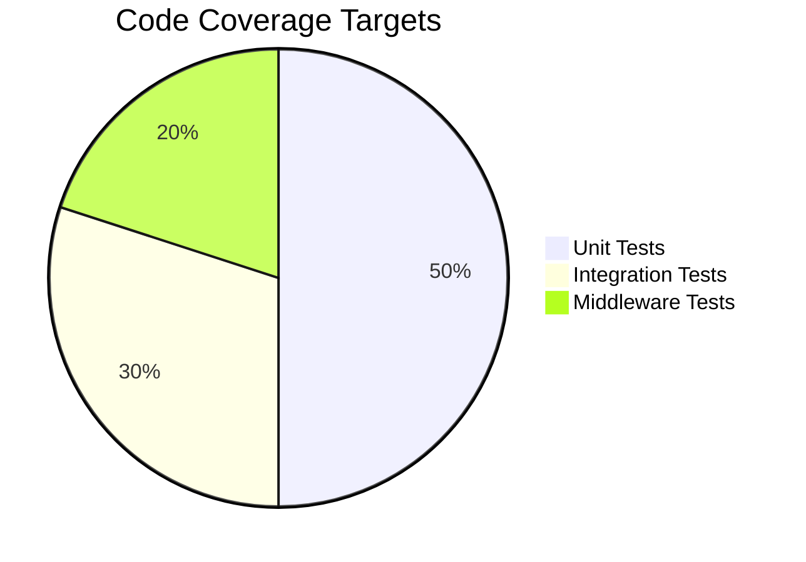

```mermaid
sequenceDiagram
    participant Mobile
    participant Web
    participant US as User Service
    participant MW as Middleware
    participant DB as Database

    %% Mobile User Registration Flow
    rect rgb(0, 0, 0)
    Note over Mobile,DB: Mobile User Registration Flow
    Mobile->>US: POST /auth/register
    Note right of Mobile: Firebase Token in body
    activate US
    
    US->>MW: Validate Firebase Token
    MW-->>US: Token Valid
    
    US->>DB: Check if user exists
    DB-->>US: User not found
    US->>DB: Create user
    DB-->>US: User created
    US-->>Mobile: 201 - User registered
    deactivate US
    end

    %% Web Admin Registration Flow
    rect rgb(0, 0, 0)
    Note over Web,DB: Web Admin Registration Flow
    Web->>US: POST /admin/register
    Note right of Web: Firebase Token in body + JWT admin token in header
    activate US
    
    US->>MW: Validate JWT Admin Token
    MW-->>US: Admin Role Valid
    US->>MW: Validate Firebase Token
    MW-->>US: Token Valid
    
    alt Not Admin Role
        US-->>Web: 403 - Forbidden
    else Is Admin
        US->>DB: Check if admin exists
        DB-->>US: Admin not found
        US->>DB: Create admin
        DB-->>US: Admin created
        US-->>Web: 201 - Admin registered
    end
    deactivate US
    end
```

# Backend
~A great repository for the Backend~


# Instalar node js:

Descargar msi : https://nodejs.org/en/download/

Luego el comando "node -v" en terminal

Luego correr el powershell como administrador y correr el comando "Set-ExecutionPolicy -Scope CurrentUser -ExecutionPolicy RemoteSigned"

Luego el comando "npm -v"

# Instalar typescript

Correr los siguientes comandos: 

npm install -D typescript
npm install -D ts-node
npm install -D nodemon
npm i express body-parser cookie-parser compression cors
npm i -D @types/express @types/body-parser @types/cookie-parser @types/compression @types/cors

# Instalar PostgreSQL

npm install pg @types/pg dotenv

# Prueba de test-db

npx ts-node src/test-db/testdb.ts

# Workflow for user/admin register



## Esquema de Usuario: Validaciones de Registro

Este esquema define los campos requeridos para el registro de un usuario general (usuario de mobile) y de un administrador (usuario de web), así como sus reglas de validación para garantizar consistencia y seguridad en los datos.

## Campos requeridos

| Campo       | Tipo    | Reglas de Validación                                                                 |
|-------------|---------|---------------------------------------------------------------------------------------|
| `email`     | String  | - Debe ser un correo válido<br>- Debe terminar en `@ucr.ac.cr`<br>- **Requerido**       |
| `full_name` | String  | - Mínimo 3 caracteres<br>- Máximo 25 caracteres<br>- Solo letras (incluyendo acentos) y espacios<br>- **Requerido** |

No se requiere source: web | mobile por el momento ya que se tendrán 2 endpoints para cada funcionalidad:

# User Management API

## Registration Endpoints

### Register User
`POST /user/auth/register`

#### Request
```json
{
  "email": "usuario@ucr.ac.cr",      // Required, must be @ucr.ac.cr
  "full_name": "Juan Pérez",         // Required, 3-25 chars, letters & spaces
  "idFirebase": "123e4567-e8...",   // Optional URL
  "firebaseToken": "token123..."     // Required
}
```

#### Headers
No special headers required

#### Response
```json
// Success (201)
{
  "status": 201,
  "message": "User registered successfully."
}

// Error (400, 401, 409, 500)
{
  "status": 400,
  "message": "Validation error",
  "details": ["El correo debe ser institucional de la UCR"]
}
```

### Register Admin
`POST /admin/auth/register`

#### Request
```json
{
  "email": "admin@ucr.ac.cr",       // Required, must be @ucr.ac.cr
  "full_name": "Admin User",        // Required, 3-25 chars, letters & spaces
  "profile_picture": "http://...",  // Optional URL
  "firebaseToken": "token123..."    // Required
}
```

#### Headers
```http
Authorization: Bearer <jwt-token>    // Required, must contain admin role
```


### Códigos de estado esperados

| Código | Tipo de error                       | Descripción                                                                 |
|--------|-------------------------------------|-----------------------------------------------------------------------------|
| 400    | Bad Request                         | Alguno de los campos no cumple con las validaciones establecidas (Yup).    |
| 401    | Unauthorized                        | Token de Firebase inválido o ausente.                                      |
| 403    | Forbidden                           | El usuario autenticado no tiene permisos para crear un nuevo admin.        |
| 409    | Conflict                            | El correo ya existe en la base de datos (usuario o admin duplicado).       |
| 500    | Internal Server Error               | Error inesperado del servidor (por ejemplo, error de conexión a DB, etc).  |

---

### Ejemplo de error 400 (Validación)

```json
{
  "status": 400,
  "message": "Validation Error",
  "details": ["El correo debe ser institucional de la UCR"]
}
```
### Ejemplo de exito 2001

```json
{
  "status": 201,
  "message": "User/Admin registered successfully."
}
```

# Testing

The project includes a comprehensive test suite covering both unit and integration tests for the registration flows. The tests are written using Jest and Supertest.

## Running Tests

```bash
# Run all tests
npm test

# Run tests with coverage report
npm run test:coverage

# Run only unit tests
npm run test:unit

# Run only integration tests
npm run test:integration

# Run tests in watch mode
npm run test:watch
```

## Test Files Structure

```
src/
├── test/
│   ├── setup.ts             # Global test setup
│   └── mocks/
│       └── firebase.mock.ts # Firebase mocks
└── features/
    └── users/
        ├── __tests__/
        │   └── register.service.unit.test.ts
        └── controllers/
            └── __tests__/
                └── register.controller.integration.test.ts
```

## Test Coverage Report

After running `npm run test:coverage`, a coverage report will be generated in the `coverage/` directory. You can open `coverage/lcov-report/index.html` in your browser to view the detailed coverage report.

Coverage goals by component:
- Services: 90%
- Controllers: 85%
- Repositories: 85%
- Middleware: 80%
- DTOs/Entities: 75%

## What's Being Tested

### Unit Tests
- User registration service
  - Email validation
  - User creation
  - Error handling
- Admin registration service
  - Role validation
  - Admin creation
  - Error handling

### Integration Tests
- User registration endpoint
  - Successful registration
  - Validation errors
  - Duplicate email handling
- Admin registration endpoint
  - Successful registration
  - Role authorization
  - Error handling

### Test Environment
- Uses an in-memory test database
- Firebase authentication is mocked
- JWT validation is mocked for admin routes

# Testing Strategy

## Overview
The testing strategy focuses on achieving comprehensive test coverage for both user and admin registration flows. Our goal is to maintain a minimum of 80% code coverage across all components.

## Testing Layers

### 1. Unit Tests
- **Service Layer**
  - `RegisterService`
    - User registration validation
    - Admin registration validation
    - Firebase token verification
    - Duplicate email checks
    - Password validation rules

- **Repository Layer**
  - `UserRepository`
    - User creation
    - User existence checks
  - `AdminRepository`
    - Admin creation
    - Admin existence checks

### 2. Integration Tests
- **API Endpoints**
  - `POST /user/auth/register`
    - Successful user registration
    - Invalid email format
    - Non-UCR email
    - Invalid Firebase token
    - Duplicate email registration
  - `POST /admin/auth/register`
    - Successful admin registration
    - Invalid admin JWT token
    - Missing admin role
    - Invalid Firebase token
    - Duplicate admin registration

### 3. Middleware Tests
- **Authentication Middleware**
  - Firebase token validation
  - Admin JWT validation
  - Role-based access control

## Test Coverage Goals


| Component | Coverage Target |
|-----------|----------------|
| Services | 90% |
| Repositories | 85% |
| Controllers | 85% |
| Middleware | 80% |
| DTOs/Entities | 75% |

## Running Tests
```bash
# Run all tests with coverage
npm run test:coverage

# Run unit tests only
npm run test:unit

# Run integration tests only
npm run test:integration
```

## Coverage Reports
Coverage reports are generated in the `coverage/` directory after running tests. The report includes:
- Line coverage
- Branch coverage
- Function coverage
- Statement coverage

## Test Conventions
1. Test files should be named `*.test.ts`
2. Test suites should mirror the structure of the source code
3. Use descriptive test names following the pattern: `should [expected behavior] when [condition]`
4. Each test should focus on a single functionality
5. Use mocks for external dependencies (Firebase, Database)

## Continuous Integration
- Tests run automatically on each push and pull request
- Coverage reports are generated and uploaded as artifacts
- Pull requests require passing tests and minimum coverage thresholds