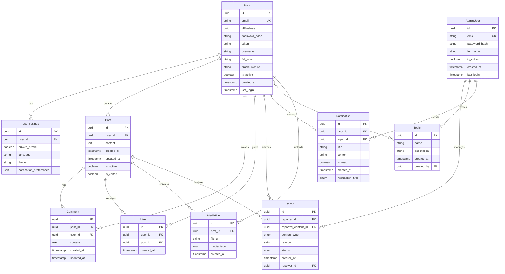

# Entity-Relationship Diagram for UCR Connect

## Entity Descriptions

### User
- Main user entity for regular application users
- Stores authentication and profile information
- Linked to posts, comments, likes, and settings

### UserSettings
- Stores user preferences and configurations
- One-to-one relationship with User
- Handles privacy, language, and theme settings

### Post
- Main content entity for user publications
- Can contain text and media files
- Tracked for edits and active status

### Comment
- User comments on posts
- Tracked for edits
- Linked to both user and post

### Like
- Represents user likes on posts
- Simple relationship between user and post
- Timestamp for analytics

### MediaFile
- Stores information about uploaded media (images/GIFs)
- Linked to posts and users
- Tracks file metadata

### Report
- Handles content moderation reports
- Can be linked to various content types
- Tracks resolution status

### Notification
- System and user-generated notifications
- Can be linked to topics for mass notifications
- Tracks read status

### Topic
- Groups notifications for mass sending
- Created and managed by admins
- Users can subscribe to topics

### AdminUser
- Separate entity for administrative users
- Enhanced permissions and capabilities
- Manages reports and notifications

## Design Considerations

1. **Scalability**
   - UUID usage for primary keys
   - Separate tables for different content types
   - Efficient indexing structure

2. **Performance**
   - Denormalization where needed for read performance
   - Timestamp tracking for caching strategies
   - Efficient relationship design

3. **Security**
   - Separate admin user table
   - Role-based access control
   - Audit trail capabilities

4. **Data Integrity**
   - Foreign key relationships
   - Status tracking for content
   - Soft delete capabilities

5. **Compliance**
   - User privacy settings
   - Content moderation capabilities
   - Data retention tracking