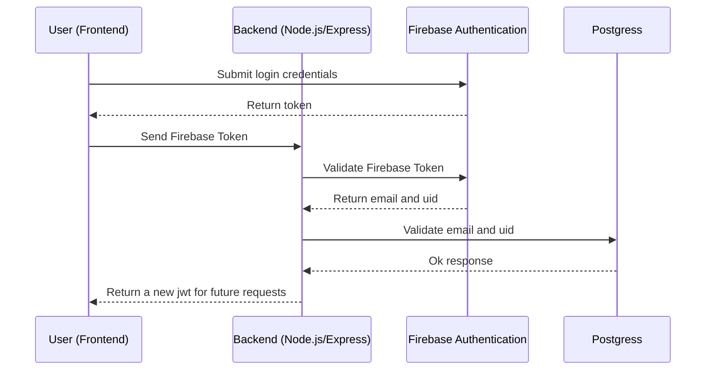

# Login Process

## Backend focus

- Frontend manage login.

## Frontend focus

- Frontend just send credentials to backend and Backend connect with firebase.

## Hybrid focus

- Frontend in charge of login using Firebase SDK.
- Backend validate the token that Frontend sends.

