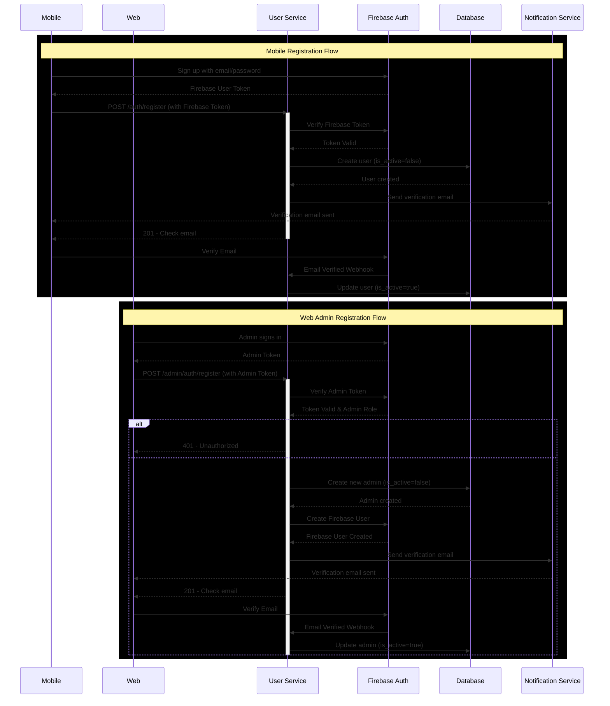

```mermaid
sequenceDiagram
    participant Mobile
    participant Web
    participant US as User Service
    participant FA as Firebase Auth
    participant DB as Database
    participant NS as Notification Service

    %% Mobile Registration
    rect rgb(0, 0, 0)
    Note over Mobile,NS: Mobile Registration Flow
    Mobile->>FA: Sign up with email/password
    FA-->>Mobile: Firebase User Token
    Mobile->>US: POST /auth/register (with Firebase Token)
    activate US
    US->>FA: Verify Firebase Token
    FA-->>US: Token Valid
    US->>DB: Create user (is_active=false)
    DB-->>US: User created
    US->>NS: Send verification email
    NS-->>Mobile: Verification email sent
    US-->>Mobile: 201 - Check email
    deactivate US

    Mobile->>FA: Verify Email
    FA->>US: Email Verified Webhook
    US->>DB: Update user (is_active=true)
    end

    %% Web Admin Registration
    rect rgb(0, 0, 0)
    Note over Web,NS: Web Admin Registration Flow
    Web->>FA: Admin signs in
    FA-->>Web: Admin Token
    Web->>US: POST /admin/auth/register (with Admin Token)
    activate US
    US->>FA: Verify Admin Token
    FA-->>US: Token Valid & Admin Role

    alt Not Admin
        US-->>Web: 401 - Unauthorized
    else Is Admin
        US->>DB: Create new admin (is_active=false)
        DB-->>US: Admin created
        US->>FA: Create Firebase User
        FA-->>US: Firebase User Created
        US->>NS: Send verification email
        NS-->>Web: Verification email sent
        US-->>Web: 201 - Check email

        Web->>FA: Verify Email
        FA->>US: Email Verified Webhook
        US->>DB: Update admin (is_active=true)
    end
    deactivate US
    end
```